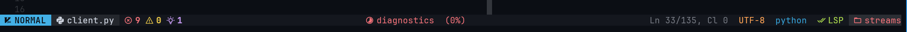

# Neovim Status Line

This is a rewrite based on [NvChad ui](https://github.com/NvChad/ui). This is
more suitable for educational purposes to understand Neovim API and how plugins
work.

The statusline is returned by `templates.{choice}.run()`.

The modes and their highlights groups are in `modes.lua`.

All the helper functions to get modes, file info, LSP info, gits.. are
in `common.lua`

The file info section needs [web-devicons](https://github.com/nvim-tree/nvim-web-devicons)
to use filetype specific icons.

## Installation

- Lazy.nvim

```lua
{
  "aghriss/statusline.nvim",
  opts = {
        theme = "vscode"
  },
  dependencies = {
   "nvim-tree/nvim-web-devicons", -- for file name icon, optional
  },

```

## Defaults

```lua
require("base46").setup(
    theme = "vscode",
    position_min_width = 140,
    overriden_modules = false,
    lsprogress_len = nil,
    git_changes_min_width = 120,
    LSP_progress_min_width = 120,
    icons = {
      modified = "",
      mode = "",
      default_file = "󰈚",
      git_branch = "",
      cwd = "󰉖",
      git_changes = { added = "", changed = "", removed = "" },
      lsp = "󰄭",
      diagnostics = {
        error = "󰅚",
        warn = "",
        hint = "󰛩",
        info = "",
      },
      spinners = {
        "",
        "󰪞",
        "󰪟",
        "󰪠",
        "󰪢",
        "󰪣",
        "󰪤",
        "󰪥",
      },
    })
```

## Demo


